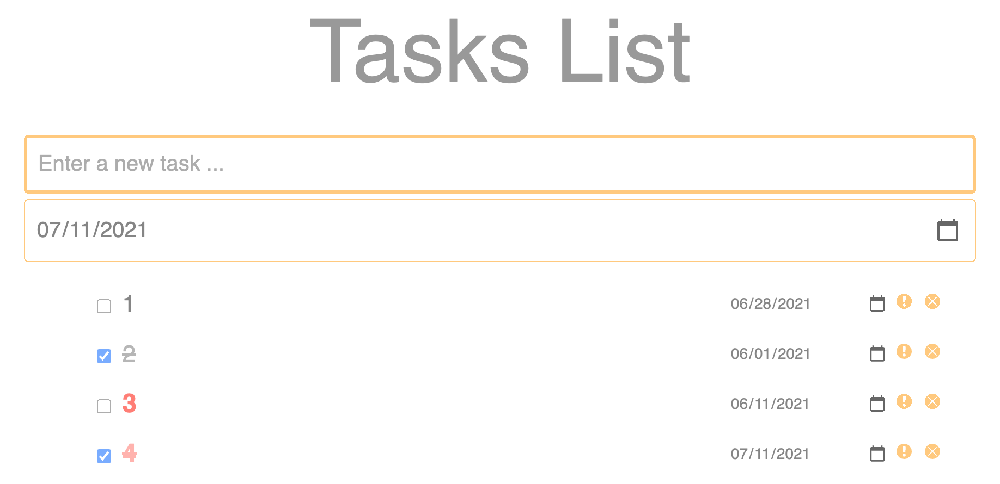

# app_tasks_list

This is a Tasks List application. I can help you to manage your tasks.  

This application is deployed on Github Page.
To check out what it look like: https://dayuantan.github.io/app_tasks_list/

## Features:

### When no task:
1. Prompt user to create tasks when no tasks existed.

### Create task:
2. User can create tasks by selecting the date and typing in the input box.
   - The default date for each task is today date.
   - User can change the date by modifying the date directly or selecting from the date-selecting panel.
  
### For existing tasks:
3. User can reorder all existing tasks by draging and droping.
4. User can mark each task as important, or cancel the important  mark.
5. User can check or check each task.
6. User can delete each task.
7. User can modify the date of each task by modifying the date directly or selecting from the date-selecting panel.

